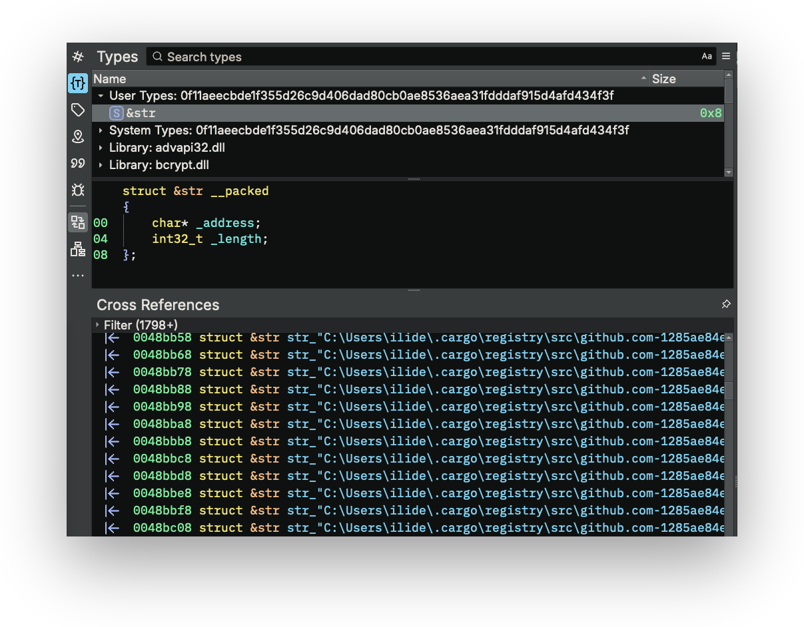

# Rust Metadata Carver

Binary Ninja plugin to find metadata from Rust binaries, including:

- Source file locations from panic unwind metadata (i.e. `core::panic::Location` structs embedded in the binary) 


## Usage

This plugin provides the following commands:

1) _Plugins_ > _Rust Metadata Carver_ > _Find Panic Location Paths_
2) _Plugins_ > _Rust Metadata Carver_ > _Recover Panic Location Metadata Structures_

First run the _Find Panic Location Paths_ command, then the _Recover Panic Location Metadata Structures_ command.

### _Plugins_ > _Rust Metadata Carver_ > _Find Panic Location Paths_

This command finds all Rust `&str` string slices in the binary that are also possible Rust source file paths.

The command will create a new `&str` type in the _Types_ pane.



### _Plugins_ > _Rust Metadata Carver_ > _Recover Panic Location Metadata Structures_

**Note: This will only work if you've run the _Find Panic Location Paths_ command first!**

This command recovers all `core::panic::Location` metadata structures from the binary. 

This command also finds all cross-references, inside the code, to each `core::panic::Location` structure. It creates a new tag (labelled with the emoji 😱) at each code location that references a `core::panic::Location` structure.


The full list of all found `core::panic::Location` metadata structures can be found in Binary Ninja's _Tags_ pane. Each `core::panic::Location` that shares the same original Rust source file path is grouped together.


## Minimum Version

4689

## License

This plugin is released under an [MIT license](./LICENSE).

## Metadata Version

2

## Development

### Setting up a development environment

To set up a development environment, including setting up a Python virtual environment:

```
python -m venv .venv && . .venv/bin/activate
python $PATH_TO_BINARY_NINJA_INSTALLATION/scripts/install_api.py
```

### Testing local versions of the plugin

To test the plugin locally in your own Binary Ninja installation during development, create a symbolic link between your development folder, and the [Binary Ninja user plugins folder](https://docs.binary.ninja/guide/index.html#user-folder), so that your development folder is loaded by Binary Ninja on startup as a plugin.

- MacOS:

    ```sh
    ln -s `pwd` ~/Library/Application\ Support/Binary\ Ninja/plugins/rust_metadata_carver
    ```

- Linux:

    ```sh
    ln -s --relative . ~/.binaryninja/plugins/rust_metadata_carver
    ```

- Windows (Powershell):
    ```powershell
    New-Item -ItemType Junction -Value $(Get-Location) -Path "$env:APPDATA\Binary Ninja\plugins\rust_metadata_carver"
    ```

You should then change the values of the following Python settings in Binary Ninja to point to inside your development folder's virtual environment:

- `python.binaryOverride`: Set this to the path of the Python interpreter inside your development virtual environment, e.g. `$DEVELOPMENT_FOLDER/rust_metadata_carver/.venv/bin/python/`
- `python.virtualenv`: Set this to the path of the `site-packages` directory inside your development virtual environment, e.g. `$DEVELOPMENT_FOLDER/rust_metadata_carver/.venv/lib/python3.11/site-packages`
